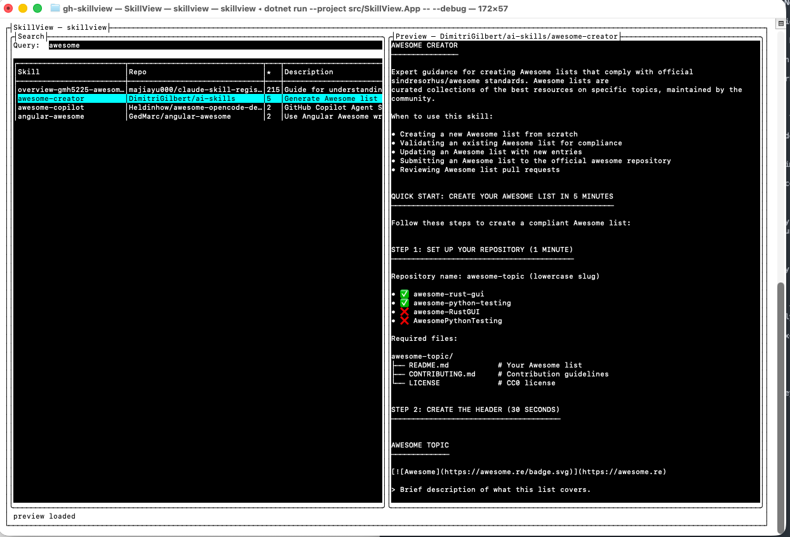

# gh-skillview

`gh-skillview` is a Terminal UI and CLI for discovering, previewing, installing, updating, removing, and cleaning up AI agent skills built on top of [`gh skill`](https://cli.github.com/manual/gh_skill).

It ships as both:

1. a GitHub CLI extension: `gh skillview`
2. a standalone binary: `skillview`

SkillView does **not** replace `gh skill`. It gives developers a faster full-screen workflow for the common cases, plus a scriptable CLI for inventory and maintenance tasks that are easier to reason about with SkillView’s safety checks and JSON output.



## Why this exists

`gh skill` is powerful, but once you start working with a lot of skills it helps to have:

- side-by-side search results and `SKILL.md` previews
- guided install and update flows instead of memorizing flags
- a unified view of installed skills across project, user, and custom roots
- safe remove and cleanup workflows for duplicates, broken symlinks, residue, and malformed installs
- a CLI you can script without giving up the interactive TUI

## What SkillView wraps

SkillView builds on GitHub CLI’s preview `gh skill` support. If you are new to the underlying commands, start with these docs:

- [`gh skill`](https://cli.github.com/manual/gh_skill)
- [`gh skill search`](https://cli.github.com/manual/gh_skill_search)
- [`gh skill preview`](https://cli.github.com/manual/gh_skill_preview)
- [`gh skill install`](https://cli.github.com/manual/gh_skill_install)
- [`gh skill update`](https://cli.github.com/manual/gh_skill_update)
- [Agent Skills specification](https://agentskills.io/specification)

## Requirements

- **GitHub CLI** `gh` **2.92.0 or newer**
- a working `gh` setup; `gh auth login` is recommended
- a terminal with normal ANSI TUI support

`gh skill` is still in preview and subject to change. SkillView probes the installed `gh` binary and only enables features whose flags are actually available.

## Install

### Install as a GitHub CLI extension

This is the primary install path.

```bash
gh extension install harder/gh-skillview
gh skillview
```

Upgrade later with:

```bash
gh extension upgrade harder/gh-skillview
```

### Install as a standalone binary

Download the right asset from the [latest release](https://github.com/harder/gh-skillview/releases), place it on your `PATH`, and run `skillview`.

| Platform | Asset |
|---|---|
| Windows x64 | `skillview-win-x64.exe` |
| Windows ARM64 | `skillview-win-arm64.exe` |
| Linux x64 | `skillview-linux-x64` |
| Linux ARM64 | `skillview-linux-arm64` |
| macOS x64 | `skillview-osx-x64` |
| macOS ARM64 | `skillview-osx-arm64` |

Release binaries are Native AOT and self-contained. You do not need a separate .NET runtime to use them.

## Quick start

Launch the TUI:

```bash
gh skillview
```

or:

```bash
skillview
```

A few good first commands:

```bash
skillview doctor
skillview search terraform
skillview list --json
skillview update --dry-run
skillview cleanup
```

## How to use SkillView

### TUI overview

Run SkillView with no subcommand to open the full-screen interface.

| View or flow | What it does | How to open |
|---|---|---|
| **Main search view** | Search public skills, refine by owner/agent/limit, preview `SKILL.md`, inspect metadata, flip the right pane between preview and logs, and stage installs. | Launch the app |
| **Doctor** | Shows `gh` path/version, auth state, detected capabilities, installed agent homes, and log location. | `d` |
| **Installed** | Lists installed skills across discovered roots, lets you filter, sort, inspect details, open the folder, or start removal. | `I` |
| **Install dialog** | Installs the selected skill with version, scope, agent, path, overwrite, and capability-gated options like hidden-dir scanning or local installs. | `i` from search results |
| **Update view** | Dry-runs or applies updates for installed skills, including `--all`, `--force`, and `--unpin` when the local `gh` supports them. | `u` |
| **Remove dialog** | Validates whether a skill can be removed safely before deleting anything. | `x` from Installed |
| **Cleanup view** | Finds duplicates, broken symlinks, residue, and other cleanup candidates; remove or ignore them in batches. | `c` |

### Main view workflow

The main window is built for the common “discover and inspect” loop:

1. Type a search query, and optionally narrow the next search with the **Owner**, **Agent**, and **Limit** fields.
2. Browse results in the left table.
3. Preview the selected skill on the right.
4. Press `i` to stage an install, `o` to open the repo in a browser, or `l` to inspect logs.

If you prefer the CLI, every major workflow also has a subcommand.

### Keyboard highlights

| Key | Action |
|---|---|
| `/` | Focus the search box |
| `Enter` | Search from the query box, or preview from a results table |
| `p`, `v`, `→` | Preview the selected search result |
| `i` | Open the install flow from the selected result |
| `d` | Open Doctor |
| `I` | Open Installed |
| `u` | Open Update |
| `c` | Open Cleanup |
| `l` or `r` | Toggle the right pane between preview and logs |
| `q` | Quit the current top-level view |

Inside modal or full-screen subviews, `Esc` consistently backs out.

**Warp note:** if `Enter` is unreliable after the first interaction, use `Ctrl+J` or `→` for preview.

## CLI usage

SkillView runs in CLI mode when you provide a subcommand.

| Command | What it is for |
|---|---|
| `skillview doctor` | Inspect environment, auth, capabilities, and log paths |
| `skillview list` | Show installed skills from filesystem and, when available, `gh skill list` |
| `skillview rescan` | Re-run inventory capture and print a summary |
| `skillview search <query>` | Search public repositories for skills |
| `skillview preview OWNER/REPO [SKILL]` | Render a skill preview without installing |
| `skillview install OWNER/REPO [SKILL]` | Install a skill with SkillView’s wrappers and diff output |
| `skillview update [...]` | Dry-run or apply skill updates |
| `skillview remove <skill>` | Remove an installed skill with safety checks |
| `skillview cleanup` | Report or apply cleanup actions |

Examples:

```bash
skillview list --json
skillview search prompt --owner github
skillview preview github/awesome-copilot documentation-writer
skillview install github/awesome-copilot git-commit --agent claude-code --scope user
skillview update --dry-run
skillview cleanup --apply --yes
```

### Global flags

```bash
skillview --debug
skillview --theme high-contrast
skillview --scan-root /path/to/skills
skillview --scan-root /path/one --scan-root /path/two list --json
```

- `--debug` works before or after the subcommand
- `--theme` currently supports `default` and `high-contrast`
- `--scan-root` is repeatable
- `SKILLVIEW_LOG=debug` is also supported

### Exit codes

| Code | Meaning |
|---|---|
| `0` | Success or nothing to do |
| `1` | User-level error |
| `2` | Invalid usage |
| `10` | Environment error |
| `20` | No matches |

## Troubleshooting

SkillView keeps a rotating file log and redacts sensitive values before writing.

- Linux: `~/.cache/SkillView/logs`
- macOS: `~/Library/Caches/SkillView/logs`
- Windows: `%LOCALAPPDATA%\\SkillView\\logs`

If the TUI behaves unexpectedly:

1. run with `--debug`
2. open Doctor with `d`
3. check the log file

## For developers

Build requirements:

- .NET SDK `10.0.100` or newer in the same feature band
- on Linux AOT publish: `clang` and `zlib1g-dev`

### Architecture

SkillView is intentionally small and explicit:

- **3 production projects**: `SkillView.Core`, `SkillView.App`, `SkillView.GhExtension`
- **1 test project**: `SkillView.Tests`
- shared logic lives in `SkillView.Core`
- both executables call the same entry point
- no DI container
- Native AOT-safe code paths by default

Execution flow:

```text
Program.cs
  -> EntryPoint.RunAsync(args)
     -> ArgParser.Parse(...)
     -> TuiServices.Build(...)
     -> CLI: CliDispatcher.RunAsync(...)
     -> TUI: SkillViewApp.Run()
```

### Project layout

| Path | Purpose |
|---|---|
| `src/SkillView.Core/` | Bootstrapping, CLI, `gh` adapters, inventory, logging, and Terminal.Gui screens |
| `src/SkillView.App/` | Standalone `skillview` entrypoint |
| `src/SkillView.GhExtension/` | `gh skillview` extension entrypoint |
| `tests/SkillView.Tests/` | xUnit coverage |
| `.github/workflows/` | CI, contract tests, and release workflows |

### Build and test

```bash
dotnet restore
dotnet build
dotnet test --no-build
```

There is no separate lint step. Build warnings and code-style violations are treated as errors.

### Run locally

```bash
dotnet run --project src/SkillView.App --
dotnet run --project src/SkillView.App -- doctor
dotnet run --project src/SkillView.App -- search prompt
```

### Publish a local AOT build

```bash
dotnet publish src/SkillView.App -c Release -r osx-arm64 \
  -p:PublishAot=true -p:StripSymbols=true -o dist/app
```

On Linux, install `clang` and `zlib1g-dev` first.

## Built with

- [Terminal.Gui](https://github.com/gui-cs/Terminal.Gui) - the cross-platform .NET TUI framework
- [GitHub CLI](https://cli.github.com/) - all GitHub interaction flows through gh skill commands
- [.NET 10](https://dotnet.microsoft.com/) with Native AOT - single-binary, no runtime required
- [xUnit](https://xunit.net/)

## License

MIT. See [LICENSE](./LICENSE).
