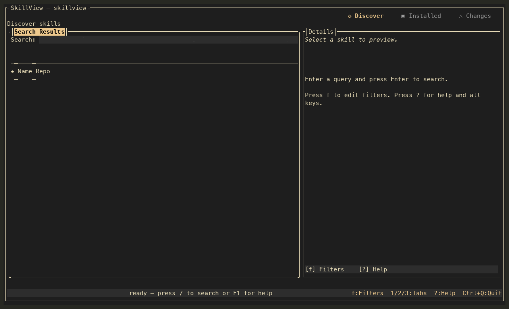
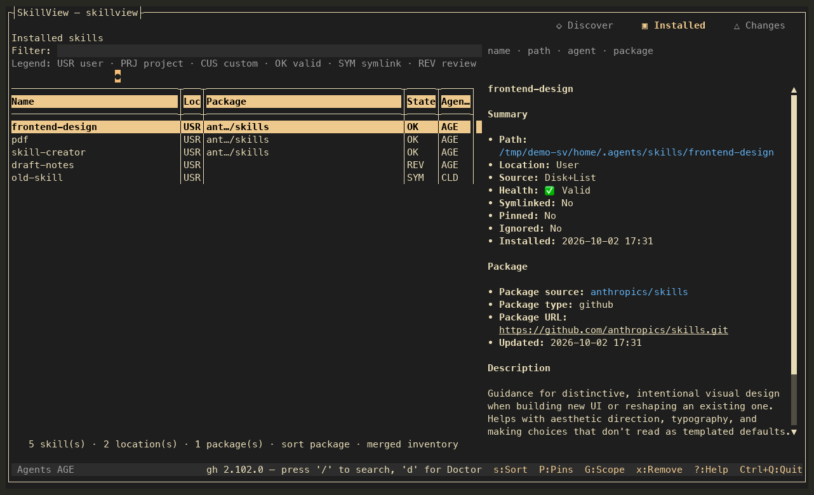
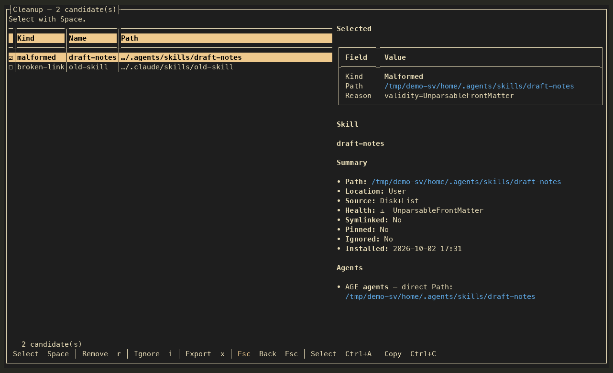

# gh-skillview

`gh-skillview` helps you find, preview, install, update, and safely remove agent skills. Use its full-screen terminal app or scriptable CLI.

[Website](https://skillview.dev/) · [Documentation](https://skillview.dev/docs.html)

[](https://github.com/harder/gh-skillview/actions/workflows/ci.yml)
[](https://github.com/harder/gh-skillview/actions/workflows/release.yml)
[](LICENSE)



## Install

You need [GitHub CLI](https://cli.github.com/) **2.97.0 or newer**. Sign in with `gh auth login` to search and install skills.

### GitHub CLI extension (recommended)

```bash
gh extension install harder/gh-skillview
gh skillview
```

Update later with `gh extension upgrade harder/gh-skillview`.

### Standalone app

Download the binary for your platform from the [latest release](https://github.com/harder/gh-skillview/releases):

| Platform | Asset |
|---|---|
| Windows x64 | `skillview-windows-amd64.exe` |
| Windows ARM64 | `skillview-windows-arm64.exe` |
| Linux x64 | `skillview-linux-amd64` |
| macOS ARM64 | `skillview-darwin-arm64` |

Put the binary on your `PATH`. On macOS and Linux, make it executable first (`chmod +x <downloaded-file>`). Release binaries are self-contained; no separate .NET runtime is needed.

## Use SkillView

Start the TUI with `gh skillview` (extension) or `skillview` (standalone). Search for a skill, select a result to preview its `SKILL.md`, and press `i` to review an install. The **Installed** tab shows local skills and their details; **Changes** shows maintenance work. Press `?` or `F1` for all shortcuts.

| Key | Action |
|---|---|
| `1` / `2` / `3` | Discover / Installed / Changes |
| `/` | Focus search |
| `i` / `I` | Install / advanced install |
| `x` | Review removal of a selected installed skill |
| `c` / `d` | Cleanup / Doctor |
| `Ctrl+Q` | Quit |

| Installed skills | Cleanup candidates |
|---|---|
|  |  |

More [screenshots](assets/screenshots) and [animations](assets/animations) are available in `assets/`.

The CLI offers the same core workflows:

```bash
skillview doctor
skillview search terraform
skillview preview OWNER/REPO SKILL
skillview install OWNER/REPO SKILL
skillview list --json
skillview update --dry-run
skillview cleanup
```

Use `gh skillview` in place of `skillview` when installed as an extension. Run `skillview --help` for commands and options. For the full keyboard reference, CLI flags, exit codes, configuration, and troubleshooting, see the [usage guide](docs/usage.md).

## Contributing

See [CONTRIBUTING.md](CONTRIBUTING.md) for development setup, architecture, tests, and contribution guidance.

## Built with

[Terminal.Gui](https://github.com/gui-cs/Terminal.Gui), [GitHub CLI](https://cli.github.com/), and [.NET 10](https://dotnet.microsoft.com/).

## License

MIT. See [LICENSE](LICENSE).
